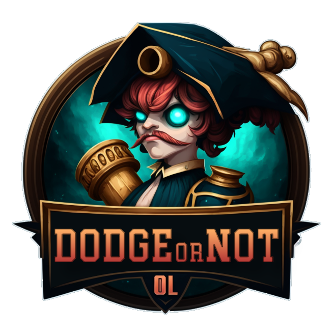
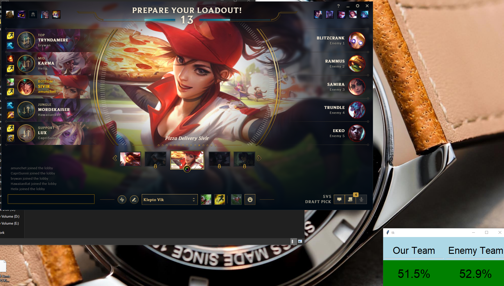

 

# DodgeOrNot

## A New Approach on When to Dodge

I’ve been thinking about one of the largest changes of the preseason: removal of summoner names.  Scouting your team with [op.gg](http://op.gg "‌") or something similar was a great way to know when to use your dodge.  With that gone, what now?

I propose looking at not just individual winrates on champions, but on how your team **works together as a whole.**  There are a few websites that look into this, but as far as I know, not many are looking at the entire two team’s synergies.

What do I mean by synergies?  I’m taking each pair of champions and looking at what their winrate is together.  By doing this for each pair of champions on each team, I can have a better guess of how well each team works together.

TL;DR I made a small program to figure this out.  Go here: [Releases · amunchet/DodgeOrNot (github.com)](https://github.com/amunchet/DodgeOrNot/releases/ "‌") and download the first one (since I don’t have a Windows developer key, your anti-virus _should_ complain.  More in the questions below).  If you have any issues or suggestions (or kindly want to leave me a star), go to the Github and let me have it: [https://github.com/amunchet/DodgeOrNot](https://github.com/amunchet/DodgeOrNot "smartCard-inline")

---

Some more in-depth details follow.

**Why are you doing this?**  I’m a one trick Viktor player.  I think team comps are especially important, especially given my champion’s limitations (for example, Viktor needs a good CC engage to really be effective).  Knowing how well the team fits around me is really important in determining whether or not the lobby has good odds of success.

**Does this work?**  I’ve personally been finding that team differentials of greater than 2% (i.e. our team has a 52% win rate based on comp, theirs has a 49%) are significant.  Within 1% or so becomes more of a coinflip.  Now will a Challenger Teemo main absolutely dumpster me, no matter what?  Of course.  I’m just looking for an odds advantage over a large number of games.

**How do I deal with tiers?**  The data source I’m using goes from bottom to top - I’m personally around Plat, so it’s equally useless to me how well Challengers use a champion as Iron.  What I’m looking to understand is _generally_ how well do the champions fit together across as wide a population as possible.

**Can’t you see the summoner ids in client’s API?**  Yes, but I expect Riot to remove that before the season starts.  Also, it somewhat goes against their philosophy to continue using that, so I’m avoiding it.

**Isn’t this doing exactly what Riot doesn’t want you to do?**  This is a more philosophical question, but I believe that dodging because your team comp doesn’t look as strong as the enemy is a much better solution than dodging because that top Teemo is on a 20 game losing streak.  The former is much less of personal targeting, so I think it’s more in line with Riot wanting to eliminate the “meta” game of scouting players, etc. in Solo Queue.

**Is this program safe?** While I don’t have a Windows developer key (yes, your anti-virus will complain about it), I’m using Github actions to build the executables directly.  The source code is very basic Python, so you can read through it.

**How much of this code was AI generated?** I used ChatGPT for a fair bit and it did quite well.  The logo was also generated by Midjourney.  Very impressive.  I managed to put this together way faster than I would have without the AI assists.

‌

That’s about all I can think of - I’d love to hear your feedback either here or on Github.  Is this super dumb?  Should I just get gud and carry?  Let me know!

## Installation
1.  Start up the Riot Client and League of Legends
2.  Download the latest release of DodgeOrNot (say yes to all the scary anti-virus messages)
3.  Start up the DodgeOrNot
4.  Get into a ranked lobby and see whether or not you should dodge!

## Testing
`pytest --cov --cov-fail-under=95 tests/ --cov-report=term-missing`

## Versions
- 0.1: Pre-release, testing concepts
